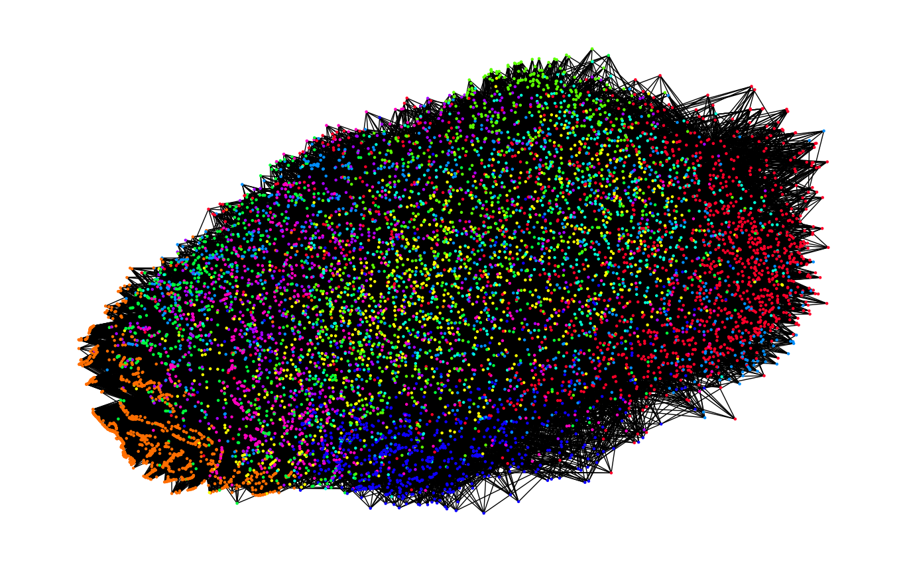
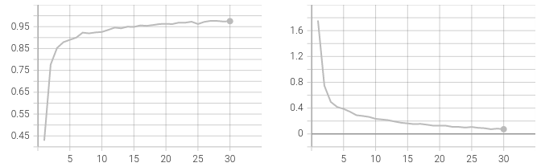
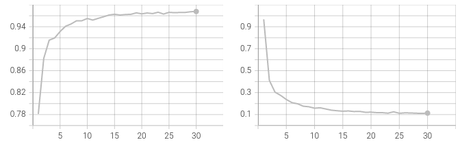
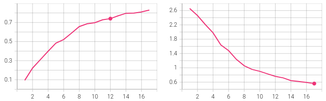
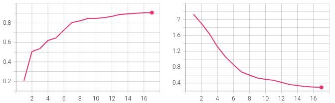
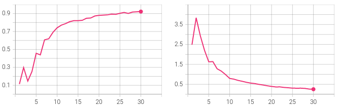
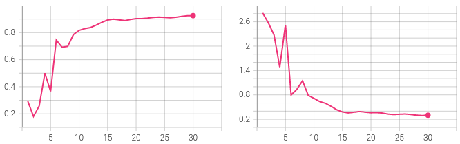

# gnn-prog-assignment

The main purpose of this assignment is to design and use graph neural networks, (deep) convolutional neural networks, and label propagation for node classification. Note that the focus of this programming project is to gain a deeper understanding of these techniques and having good recognition performance itself is not sufficient.

# Graph Generation

In order to generate the graph, we created an edge list such that an edge exists if a node is among the seven nearest neighbors of another node. To find the seven nearest neighbors, we used the k-nearest-neighbor algorithm with the distance measure based on the correlation of each image. This produces an undirected graph with 9298 nodes and 64001 edges.



# Task 1 - Graph Neural Network Design

In this task, we are asked to design three neural networks for image classification. The description of those networks is listed below:

## CNN

```
cnn.Classifier(
  (conv1): Conv2d(1, 32, kernel_size=(3, 3), stride=(1, 1))
  (pool): MaxPool2d(kernel_size=2, stride=2, padding=0, dilation=1, ceil_mode=False)
  (conv_drop): Dropout2d(p=0.3, inplace=False)
  (conv2): Conv2d(32, 64, kernel_size=(3, 3), stride=(1, 1))
  (pool): MaxPool2d(kernel_size=2, stride=2, padding=0, dilation=1, ceil_mode=False)
  (conv_drop): Dropout2d(p=0.3, inplace=False)
  (fc1): Linear(in_features=256, out_features=64, bias=True)
  (relu): ReLU()
  (fc2): Linear(in_features=64, out_features=10, bias=True)
)
```

## Spectral-based GNN

```
spectral.Classifier(
  (gc1): DenseChebConv()
  (elu): ELU(alpha=1.0)
  (dropout): Dropout(p=0.5, inplace=False)
  (gc2): DenseChebConv()
  (elu): ELU(alpha=1.0)
  (dropout): Dropout(p=0.5, inplace=False)
  (fc1): Linear(in_features=256, out_features=64, bias=True)
  (relu): ReLU()
  (fc2): Linear(in_features=64, out_features=10, bias=True)
)
```

## Spatial-based GNN

```
spatial.Classifier(
  (gat1): GATConv(
    (fc): Linear(in_features=256, out_features=768, bias=False)
    (feat_drop): Dropout(p=0.0, inplace=False)
    (attn_drop): Dropout(p=0.5, inplace=False)
    (leaky_relu): LeakyReLU(negative_slope=0.2)
    (res_fc): Linear(in_features=256, out_features=768, bias=False)
  )
  (elu): ELU(alpha=1.0)
  (dropout): Dropout(p=0.5, inplace=False)
  (gat2): GATConv(
    (fc): Linear(in_features=256, out_features=768, bias=False)
    (feat_drop): Dropout(p=0.0, inplace=False)
    (attn_drop): Dropout(p=0.5, inplace=False)
    (leaky_relu): LeakyReLU(negative_slope=0.2)
    (res_fc): Linear(in_features=256, out_features=768, bias=False)
  )
  (elu): ELU(alpha=1.0)
  (dropout): Dropout(p=0.5, inplace=False)
  (fc1): Linear(in_features=2304, out_features=64, bias=True)
  (relu): ReLU()
  (fc2): Linear(in_features=64, out_features=10, bias=True)
)
```

# Task II - Node Classification Techniques and Analyses

## DL Method

After completing a hyper-parameter search, we found that the CNN model performs best on the test set with a batch size of 32 and a learning rate of 0.01 over 6 epochs. The model is trained using the Adam optimizer and cross entropy loss. With best hyperparemeters, the model achieves accuracy of 1.0 on the test set. Below are the loss and accuracy curves on the test set during training.



Train accuracy and cross entropy loss.



Test accuracy and cross entropy loss.

The confusion matrix on the test set:
```
[[1178    1    6    0    1    5    1    0    2    0]
 [   0 1004    0    0    0    0    0    0    0    1]
 [   2    1  685    3    7    3    3    9   17    1]
 [   0    1    1  638    0   10    0    2    6    0]
 [   3    6    0    0  616    1    7    0   10    9]
 [   4    0    5    4    2  522   14    0    3    2]
 [   7    6    0    0    3    1  646    0    1    0]
 [   3    1    6    1    2    1    0  615    3   13]
 [   3    3    0    1    5    6    2    3  517    2]
 [   3    0    1    0    8    5    0    8    2  617]]
```

These results can be reproduced using the following:
```bash
python3 train_cnn.py
```

The hyperparameter search is computed using the following:
```bash
python3 train_cnn.py --param-search
```

## C&S Method

Using the C\&S method conveniently provided in the Torch Geometric package, we correct-and-smoothed the output of the CNN to a test accuracy of 0.99822. In order to do so, we used 50 node correcting iterations and 50 node smoothing iterations, with their related $\alpha$s set to 1.

The confusion matrix on the test set:
```
[[1193    0    1    3    0    0    1    2    0    0]
 [   0 1005    0    0    0    0    0    0    0    0]
 [   0    0  730    1    2    0    0    0    0    1]
 [   0    0    0  654    0    0    0    0    0    0]
 [   0    0    0    0  649    0    0    0    0    0]
 [   0    0    0    0    1  556    0    0    0    0]
 [   0    0    0    0    0    0  663    0    0    0]
 [   0    0    0    0    0    0    0  643    0    0]
 [   1    0    0    0    0    0    0    0  542    0]
 [   0    0    0    0    0    0    0    0    0  643]]
 ```

These results can be reproduced using the following:
```bash
python3 test_cnn.py --c-s
```

## Spectral Method

After completing a hyper-parameter search, we found that the spectral-based GNN model performs best on the test set with a learning rate of 0.005 over 17 epochs. The model is trained using the Adam optimizer and cross entropy loss. With best hyperparemeters, the model achieves accuracy of 92.03\% on the test set. Below are the loss and accuracy curves on the test set during training.



Train accuracy and cross entropy loss.



Test accuracy and cross entropy loss.

The confusion matrix on the test set:
```
[[1154    0    3    2    7   16    4    0    8    0]
 [   0 1003    0    0    0    1    0    0    1    0]
 [  11    1  663   13   21    3    2    7   10    0]
 [   1    1    8  609    1   20    0    7   10    1]
 [   0   14   14    0  588    0    6    3    6   21]
 [  21    2    9   26   17  461   11    1    5    3]
 [  15    8   26    0    5    5  602    0    3    0]
 [   0    1    4    0    1    3    0  617    4   15]
 [   5   10    9   25   13    8    1    4  458    9]
 [   0    5    3    2   62    2    0   47    5  518]]
```

These results can be reproduced using the following:
```bash
python3 train_gnn.py --model spectral
```

The hyperparameter search is computed using the following:
```bash
python3 train_gnn.py --model spectral --param-search
```

## Spatial Method

After completing a hyper-parameter search, we found that the spatial-based GNN model performs best on the test set with a learning rate of 0.005 over 30 epochs. The model is trained using the Adam optimizer and cross entropy loss. With best hyperparemeters, the model achieves accuracy of 92.54\% on the test set. Below are the loss and accuracy curves on the test set during training.



Train accuracy and cross entropy loss.



Test accuracy and cross entropy loss.

The confusion matrix on the test set:
```
[[1145    0    7    7    6   12    4    0   13    0]
 [   0 1000    0    0    0    1    0    1    3    0]
 [   1    5  674   16   12    4    2    3   14    0]
 [   1    1    8  615    1    8    0    7   17    0]
 [   1   13    9    0  602    0    3    1    7   16]
 [   6    2    8   38   16  458    8    0   18    2]
 [   7   15   15    0    4    5  601    0   17    0]
 [   0    1    4    0    6    5    0  591    4   34]
 [   4    5    4   10    7    3    0    2  507    0]
 [   0    2    2    2    8    6    0   10   18  596]]
```

These results can be reproduced using the following:
```bash
python3 train_gnn.py --model spatial
```

The hyperparameter search is computed using the following:
```bash
python3 train_gnn.py --model spatial --param-search
```