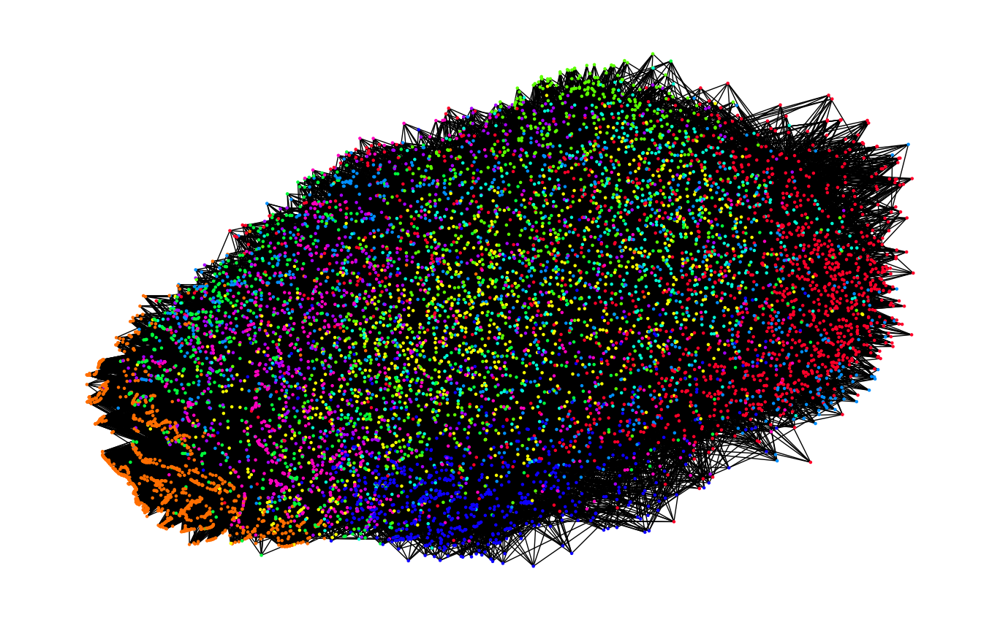

# gnn-prog-assignment

The main purpose of this assignment is to design and use graph neural networks, (deep) convolutional neural networks, and label propagation for node classification. Note that the focus of this programming project is to gain a deeper understanding of these techniques and having good recognition performance itself is not sufficient.

# Graph Generation

In order to generate the graph, we created an edge list such that an edge exists if a node is among the seven nearest neighbors of another node. To find the seven nearest neighbors, we used the k-nearest-neighbor algorithm with the distance measure based on the correlation of each image. This produces an undirected graph with 9298 nodes and 64001 edges.



# Task 1 - Graph Neural Network Design

In this task, we are asked to design three neural networks for image classification. The description of those networks is listed below:

## CNN

```
Classifier(
  (conv1): Conv2d(1, 32, kernel_size=(3, 3), stride=(1, 1))
  (pool): MaxPool2d(kernel_size=2, stride=2, padding=0, dilation=1, ceil_mode=False)
  (conv_drop): Dropout2d(p=0.3, inplace=False)
  (conv2): Conv2d(32, 64, kernel_size=(3, 3), stride=(1, 1))
  (pool): MaxPool2d(kernel_size=2, stride=2, padding=0, dilation=1, ceil_mode=False)
  (conv_drop): Dropout2d(p=0.3, inplace=False)
  (fc1): Linear(in_features=256, out_features=64, bias=True)
  (relu): ReLU()
  (fc2): Linear(in_features=64, out_features=10, bias=True)
)
```

## Spectral-based GNN


## Spatial-based GNN